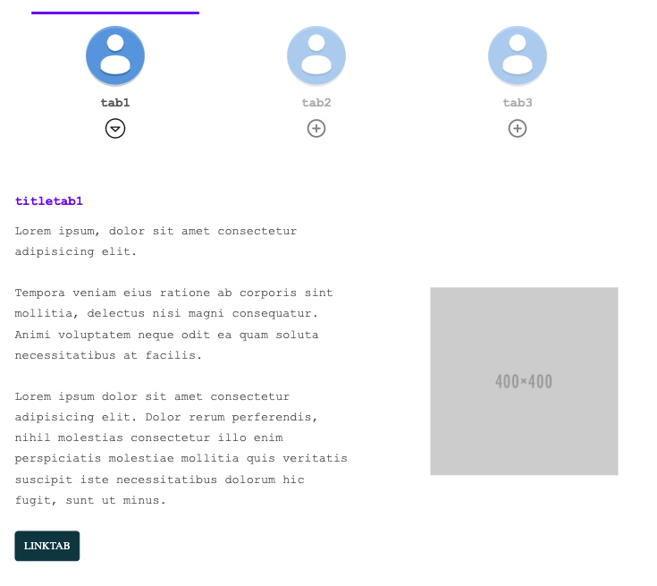
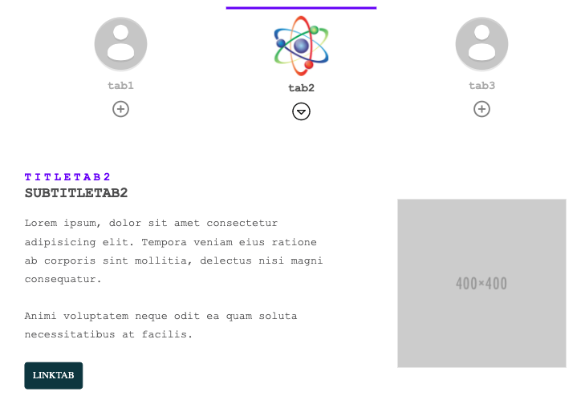
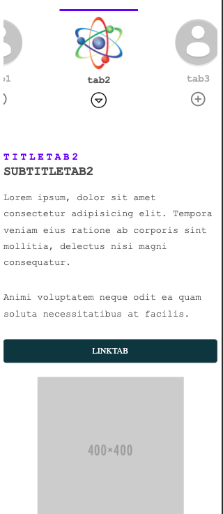
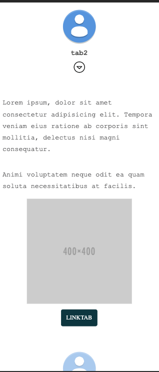

# tabs-list

Lit-Element web component tabs list.

The content is the html code inside the component. the following structure should be used with the same id:

```
<tabs-list>
  <div id="icons">
    <button>
      
    </button>
  </div>
  <div id="tabs">
    <div>
      <h3 id="title"></h3>
      <h3 id="subTitle">subtitleTab1</h3>
      <div id="description"></div>
      
      <a id="url" href="/"></a>
    </div>
  </div>
</tabs-list>

```

* Data-id => tab id.
* Optional tabs items:
      * id="subTitle"
      * id="image"
      * id="url"

## Tabs-list


## Tabs scroll-tabs="true"



## Tabs collapsible-tabs="true"



## Demo

```
<h2>Basic tabs-list Demo</h2>
<h3>Demo</h3>
<tabs-list listen-outside-event="item:selected" collapsible-tabs="true" img-icon-selected="/demo/assets/arrow-open.svg" img-icon-not-selected="/demo/assets/plus-circle.svg" break-line-separator = ";" >
        <div id="icons">
          <button>
            
          </button>
          <button>
            
          </button>
          <button>
            
          </button>
        </div>
        <div id="tabs">
          <div>
            <h3 id="title">titletab1</h3>
            <div id="description">Lorem ipsum, dolor sit amet consectetur adipisicing elit.; Tempora veniam eius ratione ab corporis sint mollitia, delectus nisi magni consequatur. Animi voluptatem neque odit ea quam soluta necessitatibus at facilis.; Lorem ipsum dolor sit amet consectetur adipisicing elit. Dolor rerum perferendis, nihil molestias consectetur illo enim perspiciatis molestiae mollitia quis veritatis suscipit iste necessitatibus dolorum hic fugit, sunt ut minus.</div>
            
            <a id="url" href="/">linktab</a>
          </div>
          <div>
            <h3 id="title">titletab2</h3>
            <div id="description">Lorem ipsum, dolor sit amet consectetur adipisicing elit. Tempora veniam eius ratione ab corporis sint mollitia, delectus nisi magni consequatur.; Animi voluptatem neque odit ea quam soluta necessitatibus at facilis.</div>
            
            <a id="url" href="/">linktab</a>
          </div>
          <div>
            <h3 id="title">titletab3</h3>
            <div id="description">Lorem ipsum, dolor sit amet consectetur adipisicing elit. Tempora veniam eius ratione ab corporis sint mollitia, delectus nisi magni consequatur. Animi voluptatem neque odit ea quam soluta necessitatibus at facilis.</div>
            
            <a id="url" href="/">linktab</a>
          </div>
        </div>
      </tabs-list>

```
<!---
```
<custom-element-demo>
  <template>
    <link rel="import" href="tabs-list.html">
    <next-code-block></next-code-block>
  </template>
</custom-element-demo>
```
-->

```html
<tabs-list></tabs-list>
```

## Properties

|                   |  Attribute              |  Type    | Description			                                                                  |                 
|-------------------|-------------------------|----------|------------------------------------------------------------------------------------|
|listenOutsideEvent	|  listen-outside-event   |string    |Name of custom event to listen and change the selected tab depends on #id from url  |
|collapsibleTabs    |  collapsible-tabs       |boolean   |True: tabs in mobile version as a collapsible                                       |
|scrollTabs         |  scroll-tabs            |boolean   |True: icons from tabs in mobile version overflow-x with scroll                      |
|iconMobileClose    |  icon-mobile-close      |string 	 |Path of the close icon image in mobile version                                      |
|imgIconSelected	  |  img-icon-selected      |string	   |Path of the icon to selected tab                                                    |
|imgIconNotSelected |  img-icon-not-selected  |string	   |Path of the icon to not selected tab                                                |
|breakLineSeparator |  break-line-separator   |string	   |String to indicate the element used to separate descriptions with break-line        |


## CSS Custom Properties

|      Name                 |  Description                          
|---------------------------|-----------------------------------------------------|
|--main-font-family		      |  Font-family to the main component                  |
|--base-font-size           |  Font-size to the main component                    |
|--main-color               |  Main color to the border top and principal title   |
|--secondary-color          |  Color to subtitle                                  |
|--main-text-color  	      |  Text color component                               |
|--secondary-text-color   	|  Text color button tab                              |
|--button-font-color   	    |  Text color link-button                             |
|--button-font-family     	|  Font family link-button                            |
|--button-font-size   	    |  Font size link-button                              |
|--button-line-height   	  |  Line height link-button                            |
|--button-tab-width-mobile  |  Tab width button in mobile                         |
|--button-tab-width-desktop |  Tab width button in desktop                        |
|--button-img-tab-height   	|  Image tab height button                            |      


## Install the Polymer-CLI

First, make sure you have the [Polymer CLI](https://www.npmjs.com/package/polymer-cli) and npm (packaged with [Node.js](https://nodejs.org)) installed. Run `npm install` to install your element's dependencies, then run `polymer serve` to serve your element locally.

## Viewing Your Element

```
$ npm run start
```

## Running Tests

```
$ npm run test
```

## Build
```
$ npm run build
```

Your application is already set up to be tested via [web-component-tester](https://github.com/Polymer/web-component-tester). Run `polymer test` to run your application's test suite locally.

##Author
**KairósDS Team**

## License

This project is licensed under the Apache 2.0 License - see the [LICENSE](LICENSE) file for details